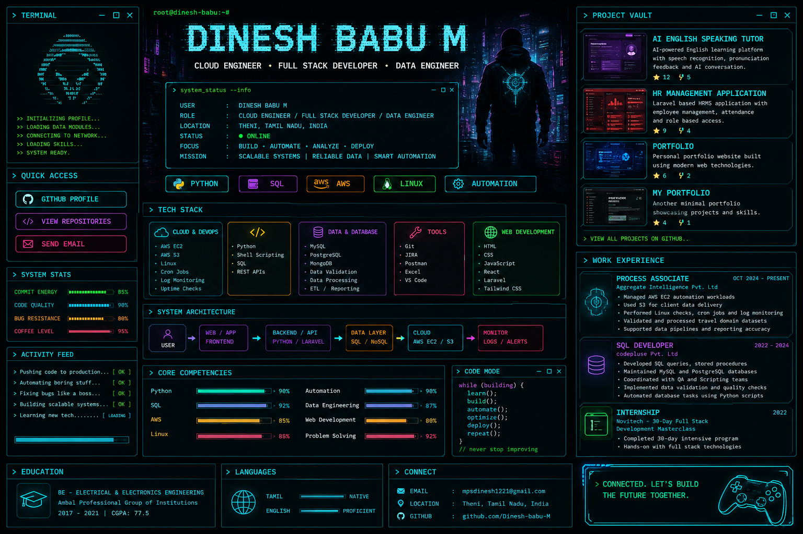

<div align="center">

# `DINESH BABU M`

### `CLOUD ENGINEER  //  FULL STACK DEVELOPER  //  DATA ENGINEER`



<br/>


<br/>

<a href="https://github.com/Dinesh-babu-M">
  
</a>
&nbsp;
<a href="https://github.com/Dinesh-babu-M?tab=repositories">
  
</a>
&nbsp;
<a href="mailto:mpsdinesh1221@gmail.com">
  
</a>

</div>

---

## `01 // TERMINAL_IDENTITY`

```text
root@dinesh-babu:~# whoami

USER       :: DINESH BABU M
ROLE       :: CLOUD ENGINEER / FULL STACK DEVELOPER / DATA ENGINEER
LOCATION   :: THENI, TAMIL NADU, INDIA
STATUS     :: ONLINE
FOCUS      :: BUILD • AUTOMATE • ANALYZE • DEPLOY
MISSION    :: SCALABLE SYSTEMS | RELIABLE DATA | SMART AUTOMATION
```

I work across **cloud operations, application development, data engineering and automation**.
My core stack is **Python, SQL, AWS and Linux**, with hands-on work in database development,
data validation, scheduled automation, cloud operations, monitoring and troubleshooting.

---

## `02 // QUICK_ACCESS`

<div align="center">

<a href="https://github.com/Dinesh-babu-M">

</a>

<a href="https://github.com/Dinesh-babu-M?tab=repositories">

</a>

<a href="mailto:mpsdinesh1221@gmail.com">

</a>

</div>

---

## `03 // TECH_STACK`

| `ZONE` | `TECHNOLOGIES` |
|---|---|
| ☁️ `CLOUD & DEVOPS` | AWS EC2 · AWS S3 · Linux · Cron Jobs · Log Monitoring · Uptime Checks |
| 🐍 `PROGRAMMING` | Python · SQL · Shell Scripting |
| 🗄️ `DATA & DATABASE` | MySQL · PostgreSQL · MongoDB · Pandas · Data Validation · ETL / Reporting |
| 🌐 `WEB DEVELOPMENT` | HTML · CSS · JavaScript · React · Laravel · Tailwind CSS |
| 🧰 `TOOLS` | Git · JIRA · Postman · Excel |

<div align="center">


</div>

---

## `04 // SYSTEM_ARCHITECTURE`

```text
USER
  │
  ▼
┌──────────────────────┐
│ WEB / APP FRONTEND   │
│ React / HTML / CSS   │
└──────────┬───────────┘
           │
           ▼
┌──────────────────────┐
│ BACKEND / AUTOMATION │
│ Python / Laravel     │
└──────────┬───────────┘
           │
           ▼
┌──────────────────────┐
│ DATA LAYER           │
│ SQL / NoSQL / ETL    │
└──────────┬───────────┘
           │
           ▼
┌──────────────────────┐
│ CLOUD                │
│ AWS EC2 / S3         │
└──────────┬───────────┘
           │
           ▼
┌──────────────────────┐
│ MONITORING           │
│ LOGS / CHECKS / OPS  │
└──────────────────────┘
```

---

## `05 // CLOUD_ENGINEERING`

```text
AWS EC2
 ├── Automation workloads
 ├── Scheduled processes
 ├── Runtime operations
 └── System monitoring

AWS S3
 ├── Data storage
 ├── Client delivery
 └── File workflows

LINUX
 ├── Cron scheduling
 ├── Log tracking
 ├── Uptime checks
 └── Troubleshooting
```

---

## `06 // DATA_ENGINEERING`

```text
SOURCE
  │
  ▼
EXTRACT
  │  Python / SQL
  ▼
VALIDATE
  │  Data Quality Checks
  ▼
TRANSFORM
  │  Python / SQL
  ▼
LOAD
  │  MySQL / PostgreSQL / MongoDB
  ▼
REPORT / MONITOR
```

**Focus:** `SQL Queries` · `Stored Procedures` · `Data Extraction` · `Validation` ·
`Transformation` · `Reporting` · `Pipeline Output Verification`

---

## `07 // FULL_STACK_MODE`

```text
             FULL STACK
                 │
        ┌────────┴────────┐
        ▼                 ▼
    FRONTEND           BACKEND
 React / HTML / CSS   Python / Laravel
        │                 │
        └────────┬────────┘
                 ▼
             DATA LAYER
          SQL / NoSQL / APIs
```

---

## `08 // AUTOMATION_CORE`

```text
MANUAL TASK
    │
    ▼
PYTHON SCRIPT
    │
    ▼
SCHEDULE / CRON
    │
    ▼
AWS / LINUX
    │
    ▼
MONITOR LOGS
    │
    ▼
VALIDATE OUTPUT
    │
    ▼
AUTOMATE AGAIN
```

---

## `09 // PROJECT_VAULT`

### `01` — AI English Speaking Tutor

**Stack:** React · TailwindCSS / Chakra UI · Web Speech API · OpenAI Whisper · OpenAI GPT · Redux Toolkit

AI-assisted English speaking platform focused on speech practice, pronunciation feedback,
vocabulary support, accent training and progress tracking.

**[ OPEN REPOSITORY ↗ ](https://github.com/Dinesh-babu-M/hero_learning-platform)**

---

### `02` — HR Management Application

**Stack:** Laravel · PHP · Vite · Tailwind CSS

Laravel application repository with application structure, database layer, routing,
testing and frontend configuration.

**[ OPEN REPOSITORY ↗ ](https://github.com/Dinesh-babu-M/hr-project)**

---

### `03` — Portfolio

Personal portfolio and web-development repository.

**[ OPEN REPOSITORY ↗ ](https://github.com/Dinesh-babu-M/Portfolio)**

---

### `04` — My Portfolio

Portfolio-oriented frontend repository.

**[ OPEN REPOSITORY ↗ ](https://github.com/Dinesh-babu-M/my-portfolio)**

<div align="center">

<a href="https://github.com/Dinesh-babu-M?tab=repositories">

</a>

</div>

---

## `10 // WORK_EXPERIENCE`

### `PROCESS ASSOCIATE` — Aggregate Intelligence Pvt. Ltd

```text
AWS EC2       → Automation workloads
AWS S3        → Client data delivery
Linux         → Cron / logs / uptime
Data          → Validate / transform / load
Monitoring    → Troubleshoot / verify outputs
```

### `SQL DEVELOPER` — codepluse Pvt. Ltd

```text
SQL Queries
Stored Procedures
Data Extraction
MySQL
PostgreSQL
Data Reporting
Data Validation
Python Automation
```

### `FULL STACK INTERNSHIP` — Novitech

```text
30-Day Full Stack Development Masterclass
Frontend + Backend fundamentals
Hands-on web development exposure
```

---

## `11 // CORE_COMPETENCIES`

```text
PYTHON          ████████████████████
SQL             ████████████████████
AWS             ██████████████████░░
LINUX           ██████████████████░░
AUTOMATION      ██████████████████░░
DATA ENGINEERING█████████████████░░░
WEB DEVELOPMENT ███████████████░░░░░
```

> Visual focus indicators only — not formal percentage scores.

---

## `12 // EDUCATION`

```text
BE — ELECTRICAL & ELECTRONICS ENGINEERING
Ambal Professional Group of Institutions
2017 — 2021
CGPA :: 77.5
```

---

## `13 // LANGUAGES`

`TAMIL` — Native  
`ENGLISH` — Professional working proficiency

---

## `14 // CONNECT`

<div align="center">

```text
┌───────────────────────────────────────────────┐
│  DINESH BABU M                                │
│  CLOUD / FULL STACK / DATA                    │
│                                               │
│  EMAIL  :: mpsdinesh1221@gmail.com            │
│  GITHUB :: github.com/Dinesh-babu-M           │
│                                               │
│  STATUS :: READY TO BUILD                     │
└───────────────────────────────────────────────┘
```

<a href="mailto:mpsdinesh1221@gmail.com">

</a>
&nbsp;
<a href="https://github.com/Dinesh-babu-M">

</a>

<br/><br/>


### `CONNECTED // LET'S BUILD THE FUTURE`

</div>
